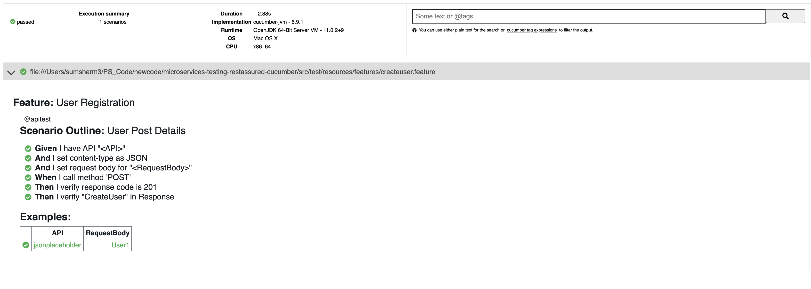

<!-- TABLE OF CONTENTS -->
<details open="open">
  <summary>Table of Contents</summary>
  <ol>
    <li>
      <a href="#about-the-project">About The Project</a>
      <ul>
        <li><a href="#accelerator-features">Accelerator Features</a></li>
      </ul>
    </li>
    <li>
      <a href="#built-with">Built With</a>
    </li>
    <li>
      <a href="#getting-started">Getting Started</a>
      	<ul>
        		<li><a href="#prerequisites">Prerequisites</a></li> 
        		<li><a href="#installation">Installation</a></li>       
        </ul>
    </li>
    <li>
    <a href="#usage">Usage</a>
        <ul>
            <li><a href="#writing-a-test">Writing a test</a></li>
            <li><a href="#testing-environment-information">Testing Environment Information</a></li>
            <li><a href="#api-under-test-information">API under test Information</a></li>
            <li><a href="#sample-feature-file-to-understand-the-keywords">Sample Feature file to understand the keywords</a></li>
            <li><a href="#key-words-used-in-cucumber-feature-files">Key Words used in Cucumber Feature Files</a></li>
            <li><a href="#running-tests">Running tests</a></li>
            <li><a href="#test-reports">Test Reports</a>
                <ul>
                <li><a href="#default-cucumber-report">Default Cucumber Report</a>
                <li><a href="#allure-reporting">Allure Reporting</a>
                </ul>
            </li>
        </ul>
    </li>
    <li><a href="#faq">FAQ</a></li>
    <li><a href="#contributing">Contributing</a></li>
    <li><a href="#contact">Contact</a></li>
  </ol>
</details>

<!-- ABOUT THE PROJECT -->
## About The Project

Welcome to PS Inner Source-Quality Engineering microservice-test-accelerator. API testing is a software testing practice that tests the APIs directly — from their functionality, reliability, performance, to security. API testing effectively validates the logic of the build architecture within a short amount of time.

This Accelerator is an API Functional Automation testing tool, and we can perform the functional testing of API's based on RestFull or SOAP Service

Below are the Accelerator Features:

### Accelerator Features
  - Tests both REST and SOAP Calls
  - Predefined Test Steps
  - Predefined Assertions
  - Soft Assertion
  - Generating the test reports
  - Jenkins Pipeline Integration
  - Environment Agnostic
  - Parallel Execution

## Built With
* **RESTAssured** - for testing the api services.
* **Cucumber** - for BDD approach.
* **Gradle** - build management tool.
* **Hamcrest** - for asserting the api responses
* **Allure** - for reporting the test results


## Getting Started

These instructions will get you a copy of the project up and running on your local machine for testing purposes.

### Prerequisites

- JDK 11+
- Gradle 6.1+
- IDE (IntelliJ or Eclipse with Cucumber Plugin)

### Installation

- Install Java and set path.
- Install Gradle and set path.
- Clone the repository using git.
    - git clone <url>


<!-- USAGE EXAMPLES -->
## Usage

This project is specifically designed to perform functional testing REST or SOAP API's:


1. Perform functional test for given application.
2. Provide Sample test to start the the API functional testing

### Writing a test

* The test case (cucumber feature file) goes in the `features` library and should have the ".feature" extension.

* You can start writing test using reference at `features/createuser.feature`. You can extend this feature or make your own features using some of the predefined cucumber steps.

### Testing Environment Information

This Accelerator is Environment agnostic and you can provide the environment information under **src/test/resources/config/envconfig.yml** file

```
commonconfigs:
   relaxed_https: 'true'
   url_encoding_enabled: 'true'
   max_timeout: '60'
   polling_time: '5'
 
qaenv:
   host_uri: 'https://jsonplaceholder.typicode.com'
   context_path: '/comments'
   follow_redirects: 'false'
   proxy: 'http://localhost:8080/'
 
devenv:
   host_uri: 'https://jsonplaceholder.typicode.com'
   context_path: '/comments'
   follow_redirects: 'false'
   proxy: 'http://localhost:8080/'`
```

### API under test Information 

As Already Mentioned in Sample Feature file how test will understand which API to test, we need to provide the api information under 

* **src/test/resources/apischema/env_name(devenv | qaenv)/jsonplaceholder**

    * **request.json** this file contains the api information
        * ```
          {
            "base_path": "{{context_path}}", --> context_path value will be picked from src/test/resources/config/envconfig.yml file
            "header": {
              "Content-Type": "application/json"  --> Default Header Values
            },
            "request": {
              "name": "microservice_test_accelerator" --> Actual API Schema
            }
          }
          ```
        * There is Host and Proxy configuration in the env file and for any api you want hit the api with different host or want to disbale the proxy for that api just male this changes request.json
           ```
          {
            "host_uri": "https://xyz.com", --> This will change the host call for this  APi
            "base_path": "{{context_path}}", --> context_path value will be picked from src/test/resources/config/envconfig.yml file
            "proxy_disabled": "true", --> This will disable the proxy configuration only for this api call
            "header": {
                "Content-Type": "application/json"  --> Default Header Values
            },
            "request": {
                "name": "microservice_test_accelerator" --> Actual API Schema
            }
          }
           ```
              
    * **request_response_mapping.yml** this file contains the information of Request Key Mapping against the Response and verify all the matching key expected and actual value in test
        * ```
          CreateUser:
            'name': 'name'
          ```
    * **testdata.yml** this file contains the test data information provide to api test (feature file)
        * ```
          User1:
            name: 'microservice_test_accelerator'
          ```
          
### Sample Feature file to understand the keywords

```
Feature: User Registration
# In this example we are setting the api name to 'jsonplaceholder' and test will automatically pick the 'User1' data from testdata.yml file and will replace the values in request template and hit the endpoint based on the 'host_uri' in 'envconfig.yml' file under 'resources/config' and base_path in request.json template. base_path value will also drive from envconfig.yml

# In the last step we are verifying the response againt the complete request, test will pick the key from 'request_response_mapping.yml' under the resources/schema/<env> and will verify the response value againt the request

  @regression
  Scenario Outline: User Post Details
    Given I have API "<API>" --> This step will Understand which API to test. "jsonplaceholder" API information Exists under the src/test/resources/apischema/env_name/jsonplaceholder
    And I set content-type as JSON
    And I set request body for "<RequestBody>" --> This step will Understand which Test data to use for API to test. API Test data information Exists under the src/test/resources/apischema/env_name/jsonplaceholder/testdata.yml and will user the "User1" Testdata from testdata.yml file
    When I call method POST --> This step will perofrm the API POST Operation
    Then I verify response code is 201
    Then I verify "CreateUser" in Response --> This step will verify the reponse verfication against the simple request being sent, This step will understand to pick the request reponse mapping from src/test/resources/apischema/env_name/jsonplaceholder/request_response_mapping.yml  and perform the verification for each key mapping present in request_response_mapping.yml file.
    Examples:
      | API             | RequestBody |
      | jsonplaceholder | User1       |
```


```
Feature: Customer Login
# This is how background can be used to eliminate duplicate steps
# For below 2 scenarios, user should first go to login page is a common step. Hence that can be given as a background step.
Background:
   User navigates to Login Page
   Given I am on login page

# Scenario with AND
Scenario:
   When I enter username as "TOM"
   And I enter password as "JERRY"
   Then Login should fail

# Scenario with BUT
Scenario:
   When I enter username as "TOM"
   And I enter password as "JERRY"
   Then Login should fail
   But Re-login option should be available
```

### Key Words used in Cucumber Feature Files

- Feature (A suitable name for your scenarios in that feature file)
- Scenario (A suitable name for the scenario you are trying to write)
- Given, When, Then, And, But (step keywords to describe the flow)
- Background (Common step to run for all scenarios in that feature file)
- Scenario Outline
- Examples (Using Scenario Outline and Examples, scenario can be repeated with multiple values from Examples table)
- | (Data Tables) - Data Tables can be used to pass multiple values in the same step
- @ (Tags) - Particular scenario/feature can be executed by running with tags.
- '#' can be used to provide Comments
Cucumber Tutorials: https://docs.cucumber.io/guides/10-minute-tutorial/


### Running tests

There are two ways to run the test from this project

1. RunCucumberTest java file at location **src/test/java/com/microservice/test/accelerator/runner/RunCucumberTest.java**
    1. You can provide the test tag information in Runner file and Just Run the Test using Java File
    2. By Default the Env name is Selected in file **src/main/java/com/microservice/test/accelerator/constants/ConfigConstants.java**
        ```
       String DEFAULT_ENV = "qaenv";
       ```
      
2. Using Command Line: Go to your project directory from terminal and execute following commands
    * `gradle cucumber` to run all the tests on default env
    * `gradle cucumber -Denv.type=<env_name> -Dtags=@<tag_name>` to run the specific tests on given env_name
    * `gradle cucumber -Denv.type=<env_name>` to run all the tests on given env

### Test Reports
 This Accelerator Supports Test Reporting using Default Cucumner Reports and Allure Reporting
 
 #### Default Cucumber Report
  You can find the basic Cucumber Report under **target/cucumber/cucumber-report.html**
  
  
  
  #### Allure Reporting
  This Accelerator also integrated with Allure Reporting Framework. You can find the report after the Tests Execution
  * directory for Allure report in the current project, **build/reports/allure-report/index.html** by default
  
  
  
  

## FAQ
**Q:** Does this Accelerator Support all HTTP status codes assertion
 
**A:** Yes, We can assert any HTTP status code using common step **Then I verify response code is 201**
 
 ##
**Q:** Does this Accelerator has Ability to manage test data across multiple Environment
 
 **A:** Yes, You can manage the test data for each environments under **src/test/resources/apischema/<env_name>**
 
 ##
**Q:** Does this Accelerator Environment Agnostic
 
**A:** Yes, You can provide multiple environments configuration in **src/test/resources/config/envconfig.yml**
 
 ##
**Q:** Does this Accelerator Support Parallel Execution of Tests
 
**A:** Yes, This Accelerator supports parallel Execution of Tests, you need to provide cucumber **--thread** count in build file cucumber options
   ```
   args = ['--plugin', 'pretty', '--plugin' , 'json:target/cucumber.json', '--plugin' , 'io.qameta.allure.cucumber4jvm.AllureCucumber4Jvm' , '--glue', 'com.microservice.test.accelerator.stepdefs', 'src/test/resources/features' , --threads,'5']
   ```
 ##
 
**Q:** Does this Accelerator has In-built Test Reporting 
 
**A:** Yes, This Accelerator Support Default Cucumber Reporting as well As Allure Reporting
 
 ##
**Q:** Does this Accelerator has ability to evaluate headers and cookies
 
**A:** Yes, you can evaluate any headers and cookeis of api under test and save it in testcontext for further use.

 ##
 
**Q:** Does this Accelerator supports Schema Validation
 
**A:** Yes, This Accelerator Support Schema Validation using JSON Schema Validation with Rest-Assured

<!-- CONTRIBUTING -->
## Contributing

Contributions are what make the open source community such an amazing place to be learn, inspire, and create. Any contributions you make are **greatly appreciated**.

1. Fork the Project
2. Create your Feature Branch (`git checkout -b feature/AmazingFeature`)
3. Commit your Changes (`git commit -m 'Add some AmazingFeature'`)
4. Push to the Branch (`git push origin feature/AmazingFeature`)
5. Open a Pull Request


## Contact
Sumit Sharma (sumit.sharma31@publicissapient.com)
